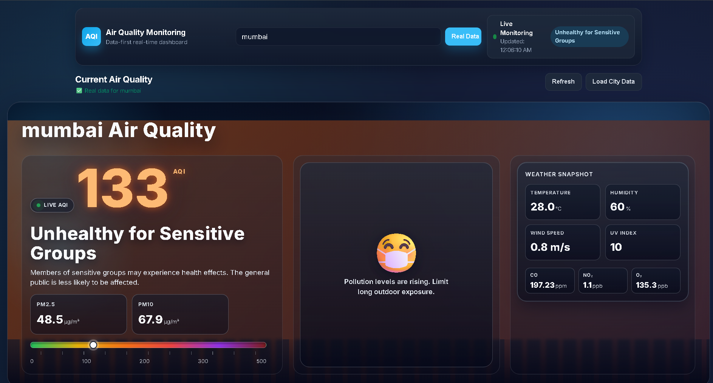
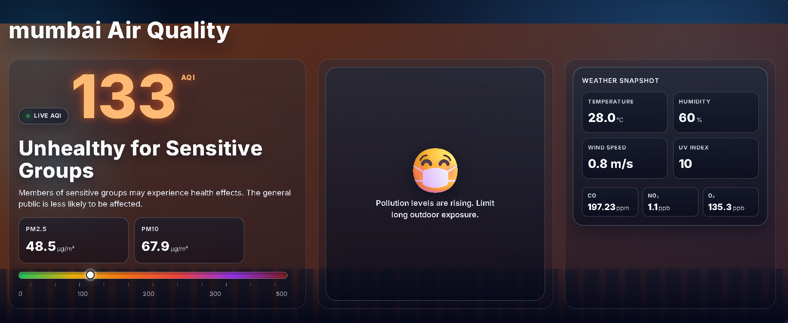
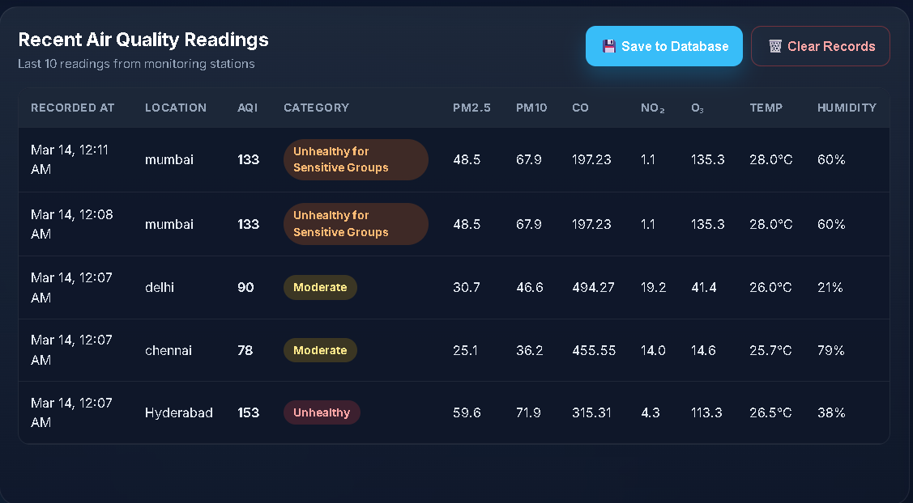
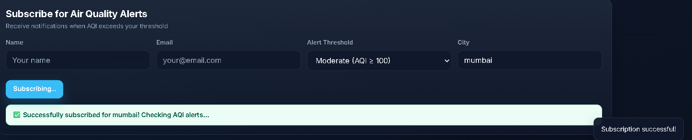
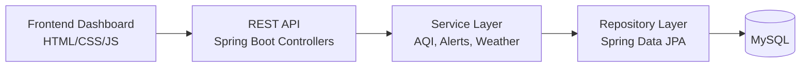
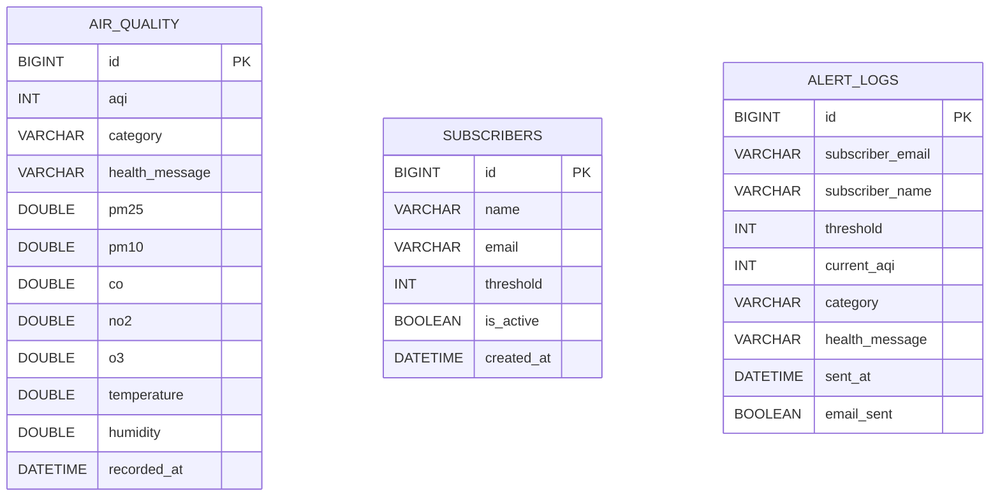

# Air Quality Monitoring and Citizen Alert System

## Badges


## Table of Contents

- [Project Overview](#project-overview)
- [Demo](#demo)
- [Key Features](#key-features)
- [Architecture](#architecture)
- [How It Works](#how-it-works)
- [Tech Stack](#tech-stack)
- [Project Structure](#project-structure)
- [Quick Start](#quick-start)
- [Installation](#installation)
- [API Endpoints](#api-endpoints)
- [Database Schema](#database-schema)
- [Screenshots](#screenshots)
- [Future Improvements](#future-improvements)
- [Contributing](#contributing)
- [License](#license)

## Project Overview

The Air Quality Monitoring and Citizen Alert System is a full-stack platform that helps users monitor city-level air quality, view recent AQI trends, and subscribe for alerts when pollution crosses thresholds.

The solution combines a lightweight web dashboard with a Spring Boot REST backend and MySQL persistence. It is designed for clear citizen visibility, easy local setup, and deployment readiness with Docker and CI/CD workflows.

## Demo

- Dashboard entry page: `index.html`
- Alternate UI page: `air2.html`
- API base URL (local): `http://localhost:8080`

### Dashboard



### City AQI Search Result



### Recent Readings Table



### Subscription Success



## Key Features

- City-based AQI search
- Real-time air quality monitoring APIs
- Recent AQI readings history
- Air quality alert subscription
- Weather data integration
- Email alert simulation
- REST API backend architecture
- Docker container deployment

## Architecture

Flow: Frontend -> REST API -> Spring Boot -> MySQL



## How It Works

1. User opens the dashboard and searches by city.
2. Frontend sends requests to Spring Boot REST endpoints.
3. Service layer fetches recent AQI/weather data and computes AQI category.
4. Repository layer persists readings and subscriptions in MySQL.
5. Scheduled jobs generate/check readings and evaluate subscriber thresholds.
6. When AQI exceeds threshold, an alert event is logged (email simulation supported).
7. UI displays current AQI, category, and recent reading history.

## Tech Stack

### Frontend

- HTML
- CSS
- JavaScript

### Backend

- Java 21
- Spring Boot 3.2.2
- Maven
- REST APIs

### Database

- MySQL
- JPA / Hibernate

### DevOps

- Docker
- Docker Compose
- GitHub Actions CI/CD
- Windows helper scripts

## Project Structure

```text
.
|-- index.html
|-- air2.html
|-- docker-compose.yml
|-- README.md
|-- assets/
|-- docs/
|-- scripts/
`-- air-quality-backend/
    |-- pom.xml
    |-- Dockerfile
    |-- docs/
    `-- src/main/
        |-- java/com/airquality/
        |   |-- controller/
        |   |-- service/
        |   |-- repository/
        |   |-- entity/
        |   |-- dto/
        |   |-- config/
        |   `-- exception/
        `-- resources/
```

## Quick Start

```bash
docker-compose up --build
```

Then open:

- Frontend: `http://localhost`
- Backend API: `http://localhost:8080`

## Installation

### Option 1: Docker

```bash
docker-compose up --build
```

### Option 2: Manual

1. Start backend:

```bash
cd air-quality-backend
mvn spring-boot:run
```

2. Open frontend:

- Open `index.html` in your browser.

## API Endpoints

- `GET /api/air-quality/{city}`
- `GET /api/history/{city}`
- `POST /api/subscribe`
- `GET /api/air-quality/current`
- `GET /api/air-quality/recent`
- `GET /api/weather/current`
- `DELETE /api/unsubscribe/{email}`

## Database Schema

Primary tables used by the backend:

- `air_quality`
- `subscribers`
- `alert_logs`



## Screenshots

All screenshots are available in `assets/screenshots/` and previewed above in the Demo section.

## Future Improvements

- Live AQI map
- Real email alerts
- Better mobile support
- Data analytics dashboard
- Role-based authentication

## Contributing

1. Fork the repository
2. Create a feature branch
3. Commit your changes
4. Open a Pull Request

## License

This project is licensed under the terms of the [LICENSE](LICENSE) file.
